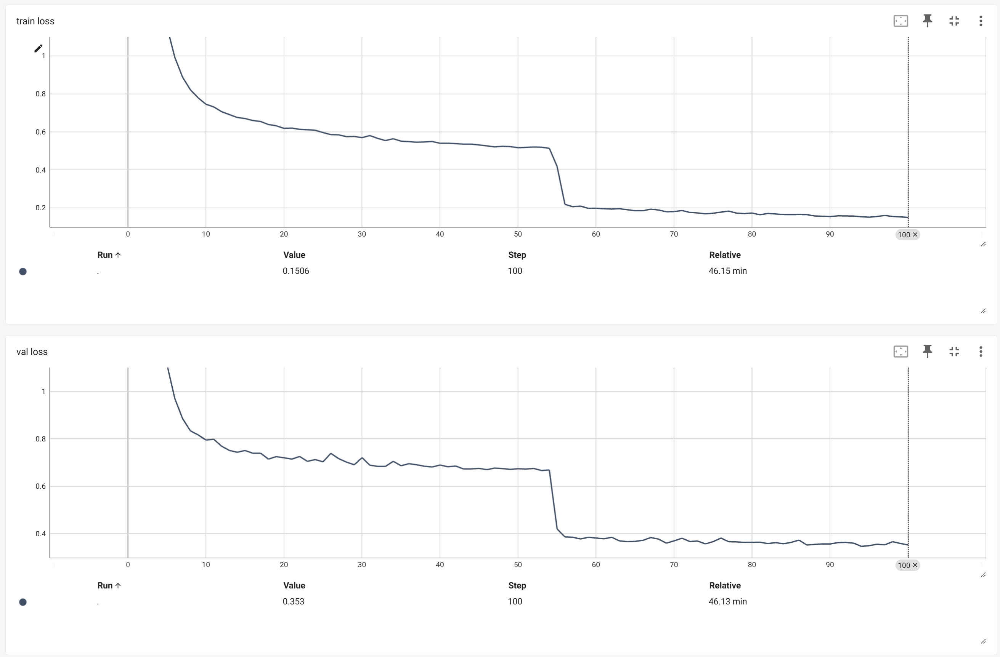

# 炼丹

- Money is all you need
- Data is all you need
- GPU is all you need

## 随机性

即使设置相同的超参数（除随机数种子），不同训练结果之间也可能存在显著差异

## lr

- 学习率需要根据每轮的step数调整，不同任务和网络适合的学习率往往不同，需要自行探索
- 学习率过大会导致收敛的loss偏大、抖动大（收敛快但效果差）
- 学习率过小会延长训练时间、需要训练更多epochs、曲线更平滑（收敛慢但效果好）
- 在训练中动态调整学习率

## batch size

## loss

**loss 是训练中明确指定最小化的指标，不同的 loss 会显著影响最后的结果与训练过程**

***example:***

例如在需连一个语义分割模型时，数据中的三类像素比例差异极大（ c 像素比列很少）。初始选择 cross entropy loss，模型对c的分割效果很差，dice很低。更换使用 dice loss 后，模型出现了训练不容易收敛的问题，推测是由于 c 像素的分割结果对 loss 影响太大导致不容易收敛。同时会出现 train/val loss 突降的情况，推测是 c 的 loss 突降导致的。此种情况，需要延长训练时间，并多次尝试，因为使得 c 的 dice 收敛的情况比较困难，并不是每次训练都能收敛。c 的 dice 从 0.1 提升至 0.9，效果显著，但训练难度上升

